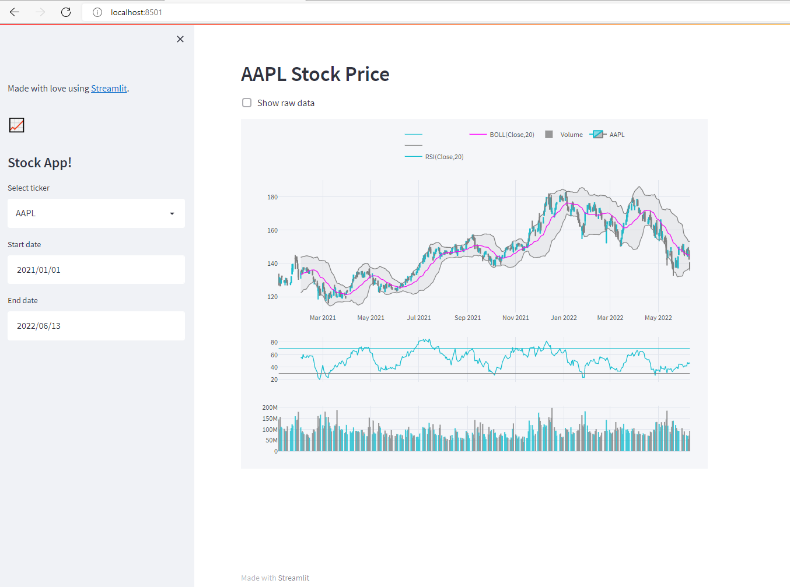

# fin_screener
A prototype stock and crytocurrency screener app in Streamlit.

### kick start from monolith:
https://2.pmam.com/Thouhgts/analytics/streamlit-data-app/

### project build with
 * Python 3.9.7

### install
 * run `setup.bat` (windows)
 * download TA-lib wheels file from: https://www.lfd.uci.edu/~gohlke/pythonlibs/#ta-lib
 * and install the downloaded file by ```pip install "path_to\TA-lib-file.wh"```

### run
 * open cmd in project root
 * run `activate.bat`
 * run `streamlit run main.py`

## preview:


### streamlit  cheat sheet:
 * https://share.streamlit.io/daniellewisdl/streamlit-cheat-sheet/app.py

### Wishlist:
 * different pages
   * trading diary
   * trading checklist
   * portfolio tracker
   * technical + fundamental screener nach markets
   * watchlist
   * alerts to telegram
   * trading bot
   * strategy backtesting and save strategy