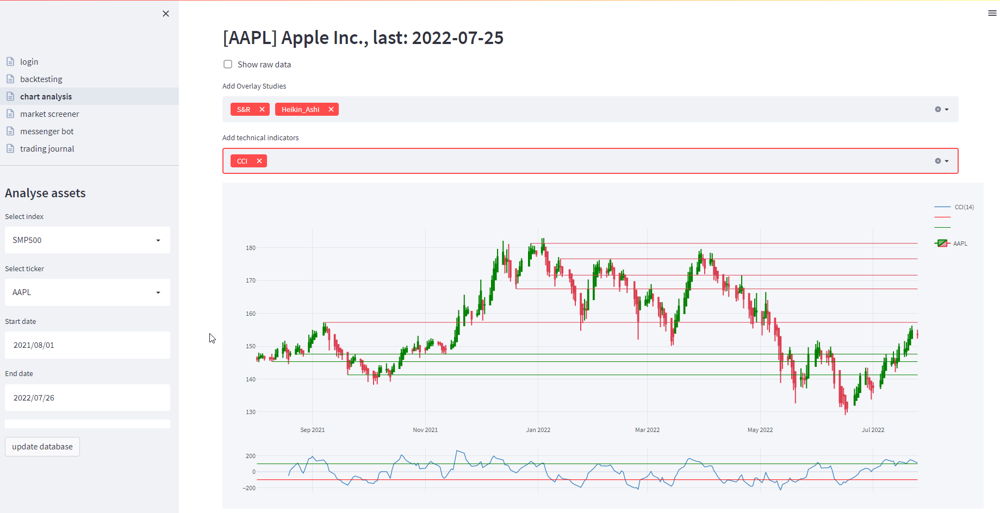
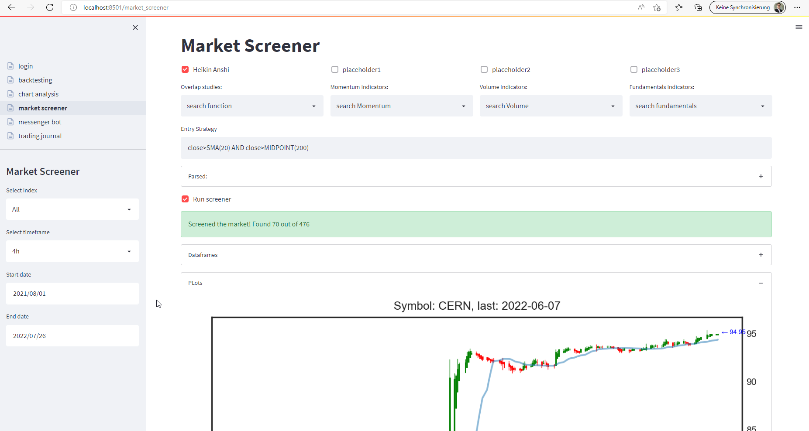

# fin_screener
A prototype stock and crytocurrency screener app in Streamlit.

### kick start from monolith:
https://2.pmam.com/Thouhgts/analytics/streamlit-data-app/

### project build with
 * Python 3.9.7

### install
 * run `setup.bat` (windows)
 * download TA-lib wheels file from: https://www.lfd.uci.edu/~gohlke/pythonlibs/#ta-lib
 * and install the downloaded file by ```pip install "path_to\TA-lib-file.wh"```
 * in a python shell inside venv, run: 
   * `>>> import nltk`
   * `>>> nltk.download()`

### run
 * open cmd in project root
 * run `activate.bat`
 * run `streamlit run main.py`

## some of the previews:
### Chart Analysis:

### Market Screener:

### Trading Journal (mock)


### streamlit  cheat sheet:
 * https://share.streamlit.io/daniellewisdl/streamlit-cheat-sheet/app.py

### Wishlist:
 * different pages
   * trading diary
   * trading checklist
   * portfolio tracker
   * technical + fundamental screener
     * chart pattern (bukowski), janaese candlesticks
     * technische indikatoren
     * overlay studies
     * fundamental business data (f.e. roi, kgv etc...)
     * markets (usa, D, etc...), business sector (tech, raw materials, etc...) 
   * watchlist
   * alerts to telegram
   * trading bot
   * strategy backtesting and save strategy

### Inspiration:
 * custom editabel table list:
   * https://stackoverflow.com/questions/69492406/streamlit-how-to-display-buttons-in-a-single-line
 * Good sw architecture in streamlit:
   * https://github.com/adenhaus/f1-data-viz

### Paid integrations:
#### Sentiment analysis:
* Socialsentiment.io
* swaggystocks.com
* quiverquant.com
* social-searcher.com
#### Stock APIs:
* Polygon