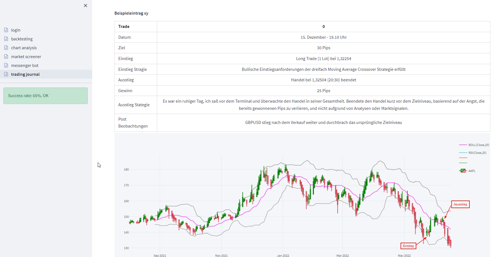

# fin_screener
A prototype stock and crytocurrency screener app in Streamlit.

### kick start from monolith:
https://2.pmam.com/Thouhgts/analytics/streamlit-data-app/

### install
 * run `setup.bat` (windows)

### run
 * open cmd in project root
 * run `activate.bat`
 * run `streamlit run main.py`

## preview:

### streamlit  cheat sheet:
* https://share.streamlit.io/daniellewisdl/streamlit-cheat-sheet/app.py

